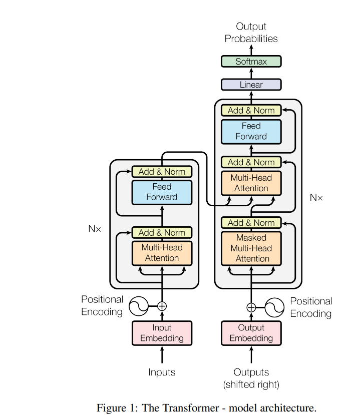
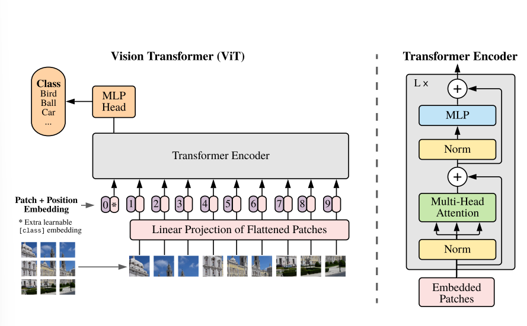

Choosing the ViT :

1. according to wikipedia History section(https://en.wikipedia.org/wiki/Vision_transformer#History), and this citation (https://en.wikipedia.org/wiki/Vision_transformer#cite_note-:3-1), this is the paper that introduced Vision transformer for the first time(https://arxiv.org/pdf/2010.11929)

2. so we should use this paper, and search for a good github code, preferably supported by a youtube video as well.

RESOUCE LIST:
a) Daniel lebourke: + Have seen this guys vids before for DL , he is legit good + video Explanation : https://www.youtube.com/watch?v=tjpW_BY8y3g + pdf explanation : https://www.learnpytorch.io/08_pytorch_paper_replicating/ + code : https://github.com/mrdbourke/pytorch-deep-learning/blob/main/08_pytorch_paper_replicating.ipynb

    b) some redditor :
            + dont know who this is
            + reddit post : https://www.reddit.com/r/MachineLearning/comments/11nj58o/p_implementing_vision_transformer_vit_from/
            + code : in above
            + medium post : in above

        c) 1.Deep Findr: Found this you tube video having code implentation and paper also shared

        code link: https://colab.research.google.com/drive/1P9TPRWsDdqJC6IvOxjG2_3QlgCt59P0w?usp=sharing

        video link: https://youtu.be/j3VNqtJUoz0?si=GKMZ3ziCYv48GGRZ

        d) repo link : https://github.com/dasunyohan/Vision-Transformers/blob/main/README.md
        Summary : data set of images of different pet breeds and using VIT to classify them into various classes .Not so detailed implementation but I think code can be easily modified by us as told by sir.

                note : seems identical to third source

notes :

1.  ViT architechture is much simpler than arcchitecture of text based trasnformer in Attention is all you need paper. 

  <figure style="margin: 10px;">
    
    <figcaption>Attention transformer</figcaption>
  </figure>
  <figure style="margin: 10px;">
    
    <figcaption>ViT </figcaption>
  </figure>

2 . Daneils video is slightly long because he tells in detail